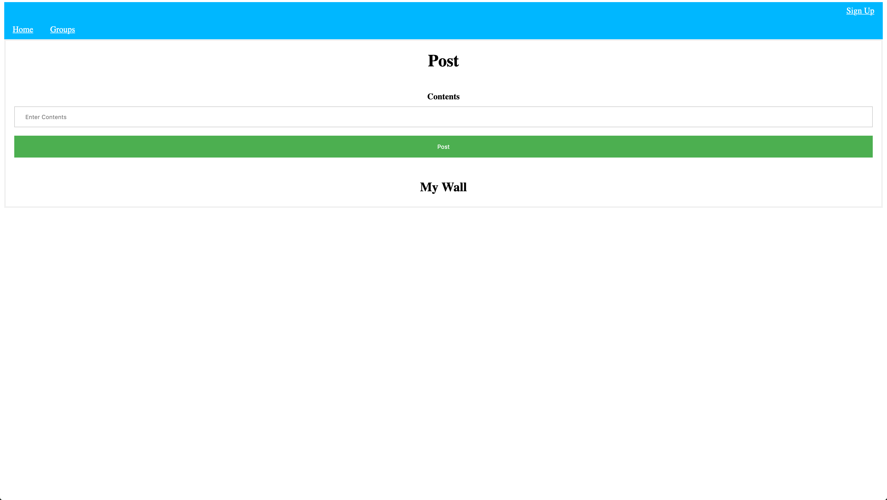
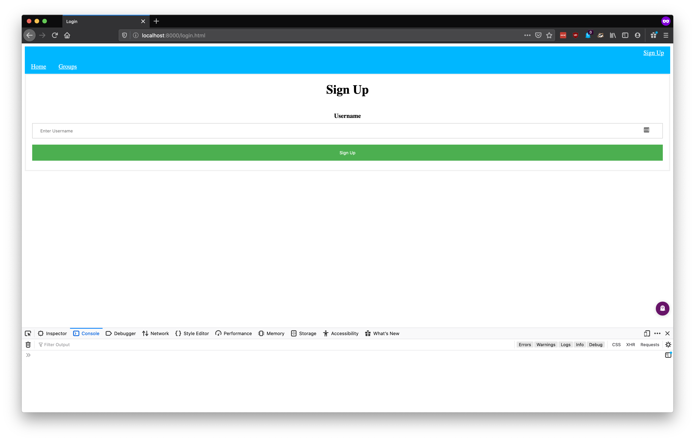
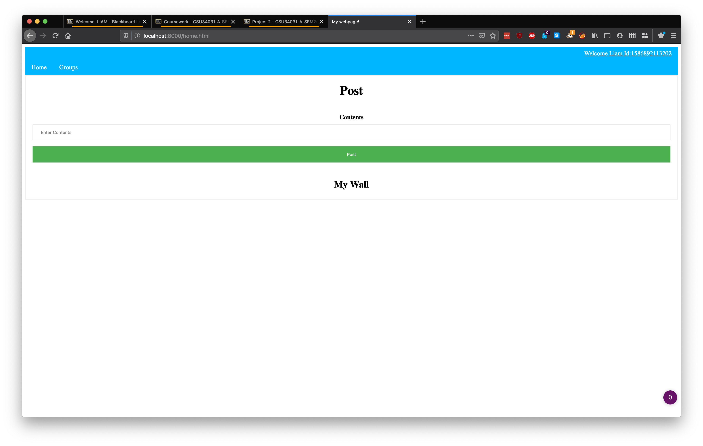
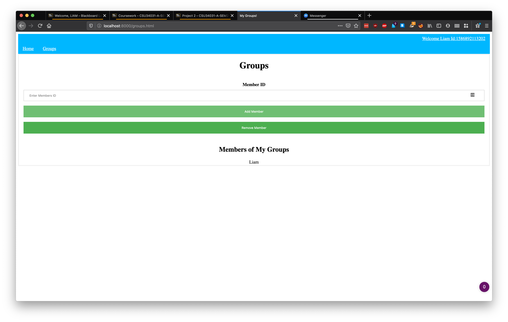
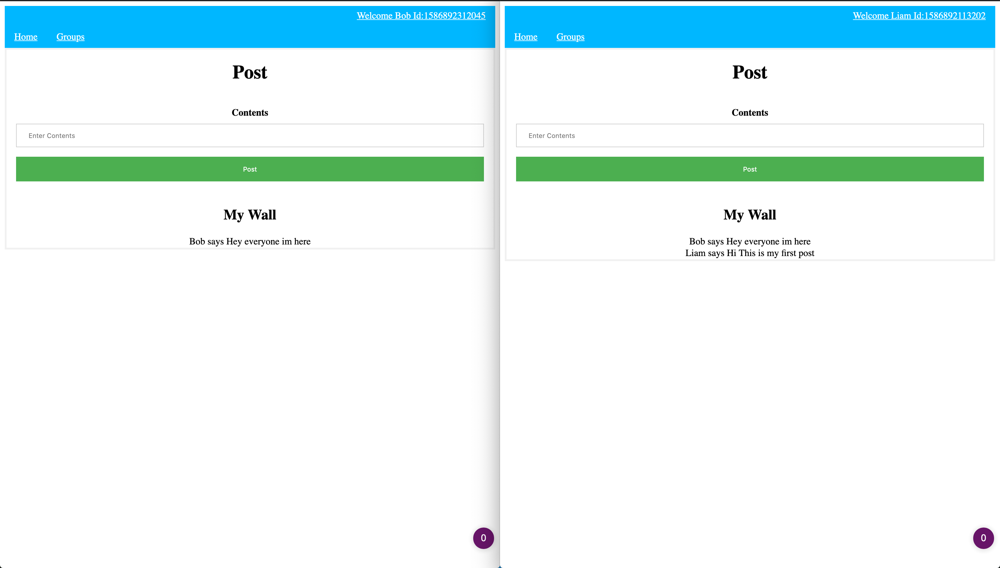
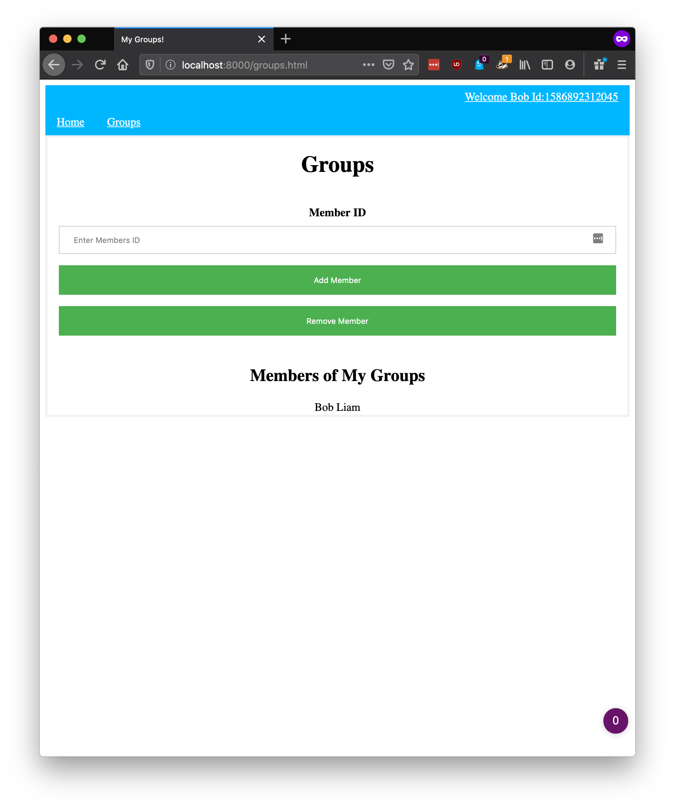
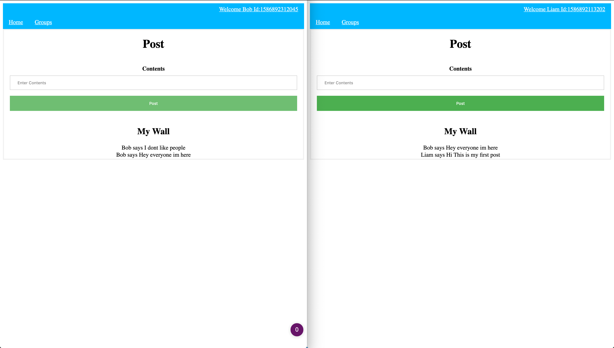
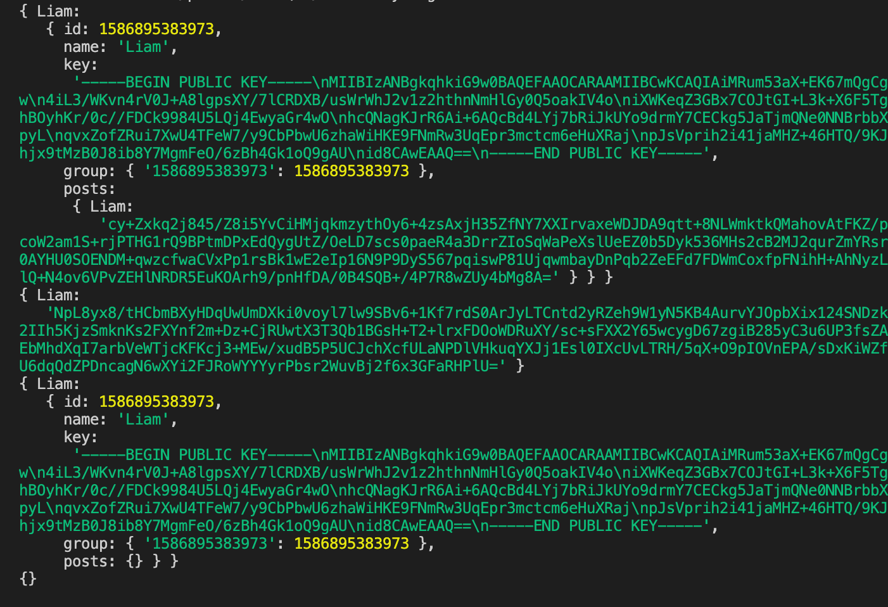

# CSU34031 Advanced Telecoms Project 2
##### Liam Sherlock | 17308853

### Overview

The overall program is separated into two segemnts. A webpage frontend and a backend to act as a intermediary betwee each user. The frontend allows users to sign up, add/remove people to their wall, post to their wall, and see other peoples posts. On the other hand the backend handles who is allowed to view which, post along with over distribution.

### Webpage



Initialy when a user navigates to the website they are greeted by their wall but as they have not signed up yet it will empty. In the top right corner they can navigate to the sign up page.



On the sign up page they simply need to type in a username. Users are specific to their browser. This is due to the overall localized design. As the majority of the required information is stored in the browser rather than a database. Upon signing up the frontend creates a private/public key pair informs the backend off the user's name, unique id, and public key. Additionaly the private key and related information is saved in the users browser. 



Upon signing up you are navigated to the home page and in the topright side of the page is the users name and id. This id is key as it allows other users to add you to their group. 


At the group page you can add new users to your group and remove users from your group. Additionaly you start as part of your group. If you do not want to see your own posts you could remove yourself from your group with your id. 


Upon posting you wall is filled with the new post. If others have added you to their group you will also see their posts that occured after you were added.



In this image you see that liam, right, has recieved bob's, left, message. This is due to the fact that bob added liam to his group.


As you can see liam is a member of bobs group.


But once bob removes liam, liam will not be able to see bobs new posts.

Video with a look into the website can be found at: https://youtu.be/SMXY1q-9kCA 

### Group Membership

The groups I handeled quite simpily. Each user has their own group to which they can add and remove users. Only the admin, the groups owner, can add and remove users. Whenever the user posts, thier posts are sent to all users in their group. When a user is removed they will no longer recive the users messages.

The groups are stored in the backend. Each user has list which represents their group.

### Key Handeling

The keys are handeled very simply. First of all the backend has a private and public key. When a user joins the backend sends its public key to the user. Any message sent from a user to the backend uses that public key. On the other hand each user generates its own private/public keys. And upon creating an account sends its public key to the backend. Whenever the backend sends data to the user it uses its public key. 

In the backend it stores its own private and public keys. It also stores list of all users and thier private keys.

On the other end users store their private and public keys along with the servers public key in the browsers local storage. 

### Sending Posts/Encryption

As I mentioned above I used private and public keys to implement the encryption. For the libraries used I used JSEncrypt. Which not only generates the keys on the front and backend but also is used to do the encrypting and decrypting.

As for the implementation when a post is recieved by the backend it sorts through the users group membership. Placing a copy of the encrypted message in in each users posts queue. 

```js
for (var key in users[uname]["group"]) {
    if (users[uname]["group"].hasOwnProperty(key)) {
        let aname = uids[key];
        users[aname]["posts"][uname] = message;
    }
}
```

The next time the recipient pulls their posts the posts are decrypted using the servers private key and then encrypted using the recipients public key before being sent off. The queue is then emptied. 

```js
for (var key in users[uname]["posts"]) {
    if (users[uname]["posts"].hasOwnProperty(key)) {   
        let message = await decrypt(privateKey, users[uname]["posts"][key])        
        resp[key] = await encrypt(users[uname].key, message)
    }
}
```

The recipient then uses their private key to decrypt the message before storing displaying the posts. Posts are also saved localy.

```js
for (var key in x) {
    if (x.hasOwnProperty(key)) {           
        posts[new Date().getTime()*-1] = {
            message:await this.getWebWorkerResponse('decrypt', x[key]),
            name: key
        }
    }
}
    var newObject = {};
    var keys = [];

for (var key in posts) {
    keys.push(key);
}
let n = document.getElementById("wall")

for (var i = keys.length - 1; i >= 0; i--) {
    let d = document.createElement("div") 
        let u = document.createTextNode(posts[keys[i]]["name"] + " says " + posts[keys[i]]["message"])
        d.appendChild(u)
        n.appendChild(d);
}
```



As these logs show liam sends a message which then is stored in liams groupmembers(only liam at the moment) posts(See the first posts: blob containing a clearly encrypted message from liam). Bellow that you can see the message that is being sent. To liam but now the message has a diferent encryption. Finaly once you can see that liam's info no longer contains any posts as all posts in the cache have been sent.

### Database
For the backend there is no database. The backend simply contains a list of all users, group membership, and caches posts before they are sent to the end users. As soon as posts are passed to the end user they are deleted. As such the users store the posts they recieve localy.

<div style="page-break-after: always;"></div>


### Apendix

Code: https://github.com/Liampobob/AdvTelecoms
Video: https://youtu.be/SMXY1q-9kCA